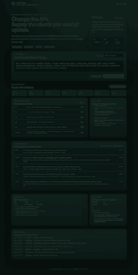

# VersionGhost

> **An AI compatibility agent that changes a live-service API only after replaying the historical mobile clients that still depend on it.**

VersionGhost is a developer-productivity project built for a public AI Programmer job description centered on LLM services, full-stack delivery, code generation, and workflow automation.

A normal coding agent looks at today's repository. A mobile live service can still have yesterday's app versions calling tomorrow's backend. VersionGhost turns those old clients into an independent verification surface that the code-generation loop cannot edit.

## What makes this project different

The main screen is not a chatbot and the project is not another miniature IDE assistant.

```text
feature request
    ↓
change contract
    ↓
impact map
    ↓
model-generated bounded patch
    ↓
historical client replay matrix
    ↓ fail
bounded repair
    ↓
same replay matrix
    ↓
requirement-to-evidence merge packet
```

The built-in synthetic scenario asks for a new v2 streak-bonus response while preserving v1.4/v1.9 clients, idempotent retries, a three-claim daily limit, and a retry that crosses a client upgrade. The first implementation attempt is deliberately plausible but incompatible: v2 works while older clients fail. The repair separates canonical reward state from version-specific rendering and is judged against the exact same replay surface.

## Demo

```bash
python -m pip install -e .
uvicorn versionghost.main:app --reload
```

Open `http://127.0.0.1:8000`.

For a keyless CLI proof:

```bash
python -m versionghost.cli demo > merge-packet.json
```

The default demo uses a deterministic provider so anyone can reproduce the agent/verification/repair path without credentials. That route validates orchestration and gates; it is **not** presented as a model-quality benchmark.



The screenshot above is rendered by the committed frontend from the saved API end-to-end run in `artifacts/api-e2e-run.json`; it is synthetic demo evidence, not production traffic.

## Model routes

VersionGhost separates model choice from the verification authority.

- **Deterministic demo** — reproducible, no external service required.
- **OpenAI-compatible endpoint** — intended for Ollama, vLLM, or another compatible server; default model name is `qwen2.5-coder:7b`.
- **Hosted Messages API** — optional direct adapter enabled only when the required environment credential exists.

Models can propose exact repository-local text replacements. They cannot edit tests/client fixtures through the patch engine, execute arbitrary shell commands, or choose which compatibility checks run.

## Full-stack product surface

The FastAPI service provides:

- run creation and status APIs
- background pipeline execution
- persisted run/event history in SQLite WAL mode
- impact analysis and change-contract artifacts
- bounded patch / repair orchestration
- client-version replay results
- requirement-to-evidence packets
- an API-backed browser UI with pipeline trace, compatibility matrix, attempt history, evidence ledger, and blast-radius summary

## Built-in verification surface

Synthetic client fixtures cover:

1. v1.4 legacy payload compatibility
2. v1.9 legacy payload compatibility
3. v2.0 new streak-bonus payload
4. duplicate idempotency-key behavior
5. fourth-claim daily-limit boundary
6. retry after a client upgrades from v1 to v2

The code-generation loop is blocked from editing those fixtures.

## Repository structure

```text
versionghost/
├── agent/                 # deterministic + local/open-model + hosted provider adapters
├── engine/                # impact, patch safety, checks, replay, evidence, pipeline
├── static/                # product UI
└── main.py                # FastAPI application
sample_app/liveops_service/
├── api.py
├── service.py
├── state.py
├── client_contracts/      # protected historical-client fixtures
└── tests/
tests/                     # VersionGhost tests
docs/                      # architecture, research, evaluation, limitations, JD traceability
scripts/                   # repeatable measured evaluation
```

## AI-assisted development integration

The repository includes `CLAUDE.md`, `AGENTS.md`, and `.cursor/rules/versionghost.mdc` so modern coding tools receive the same completion gates and claim discipline. These are integration rules; the repository does not claim that a specific external coding tool authored a commit unless that use is separately evidenced.

## Verification

```bash
python -m pytest -q
python scripts/evaluate_demo.py
```

Measured on the current local revision:

| Check | Result |
|---|---:|
| Repository + target-service tests | **10 passed** |
| Deterministic acceptance runs | **3/3 ready_with_evidence** |
| Attempt 1 historical replay | **3/6 passed — rejected** |
| Repaired attempt historical replay | **6/6 passed — accepted** |
| Final requirement evidence | **5/5 proven** |
| Local pipeline time | **4.584 s median** (4.552–4.662 s) |

The timing is a local orchestration measurement, not production latency. The deterministic route measures the verification/repair design, not model coding quality. Raw results are committed in `artifacts/evaluation.json`.

CI is defined for Python 3.11–3.13 and runs tests, static checks, packaging install, and the keyless end-to-end demo gate.

## Deployment

A container definition and Render manifest are included. A public URL is intentionally not claimed until the new repository is created, deployed, and smoke-tested.

## Research and design docs

- [`docs/TOPIC_RESEARCH.md`](docs/TOPIC_RESEARCH.md) — public-project collision audit and why generic coding-agent themes were rejected
- [`docs/ARCHITECTURE.md`](docs/ARCHITECTURE.md) — trust boundaries and pipeline
- [`docs/JD_TRACEABILITY.md`](docs/JD_TRACEABILITY.md) — public job requirement → concrete artifact
- [`docs/DEMO.md`](docs/DEMO.md) — reviewer walkthrough
- [`docs/EVALUATION.md`](docs/EVALUATION.md) — what is and is not measured
- [`docs/AI_CODING_WORKFLOW.md`](docs/AI_CODING_WORKFLOW.md) — tool-neutral vibe-coding gate
- [`docs/BOUNDARIES.md`](docs/BOUNDARIES.md) — explicit boundaries

## Scope and honesty

This is a portfolio-grade synthetic live-service environment. It does not use real player data, production client captures, or a private company codebase. It does not infer GameSpring's internal architecture. External model routes are optional and are not described as measured unless a run artifact exists.

Copyright © 2026 윤기혁. All rights reserved. Portfolio project.
